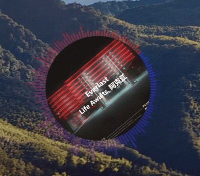
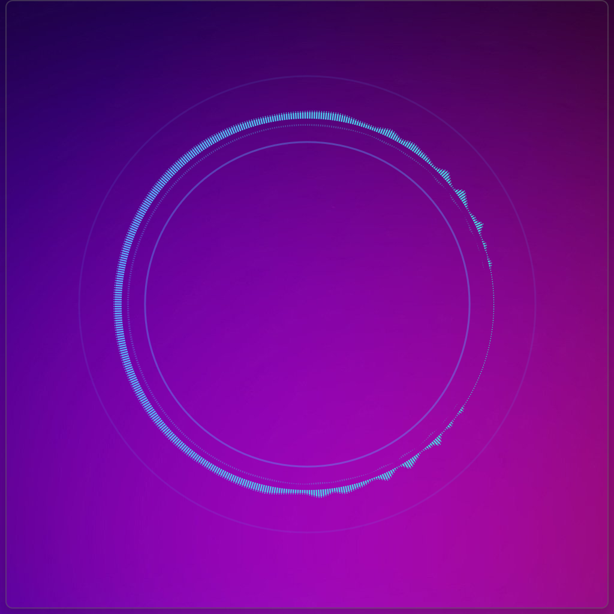
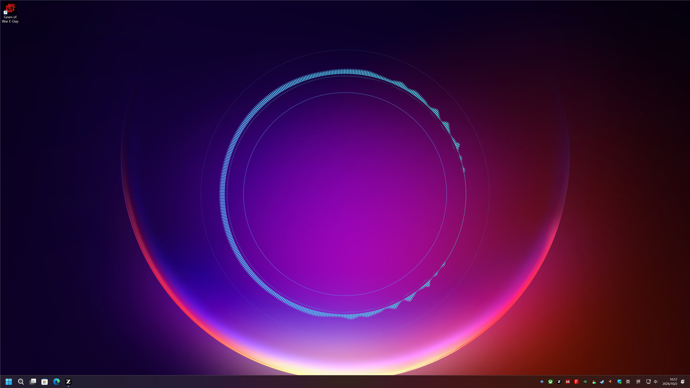
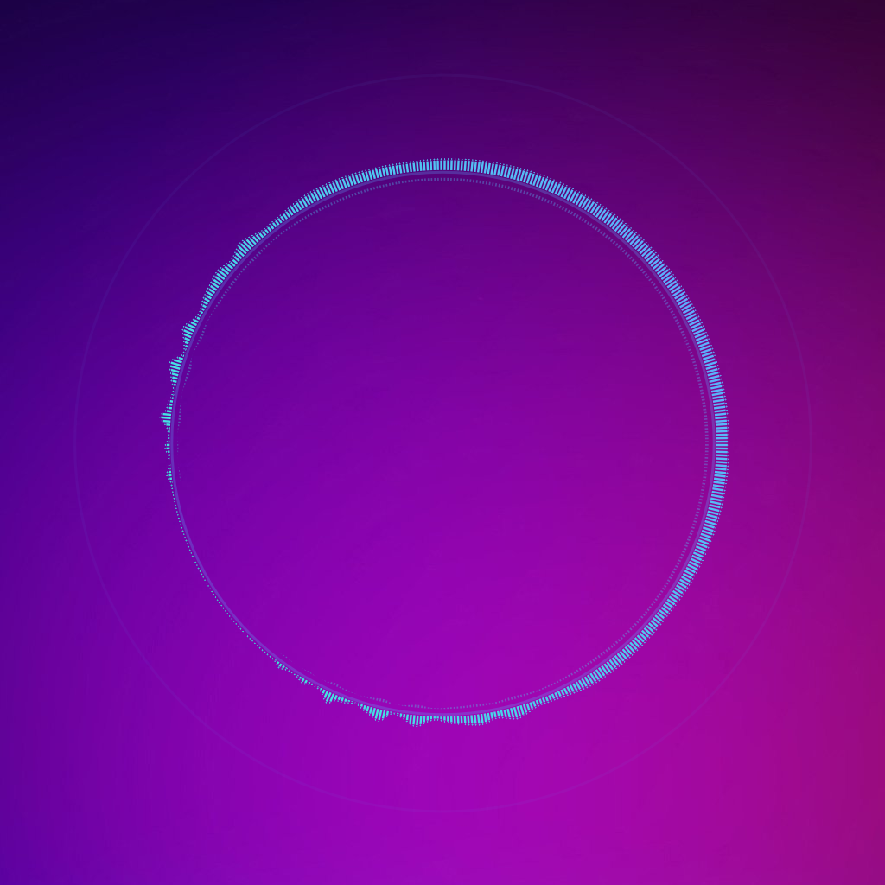
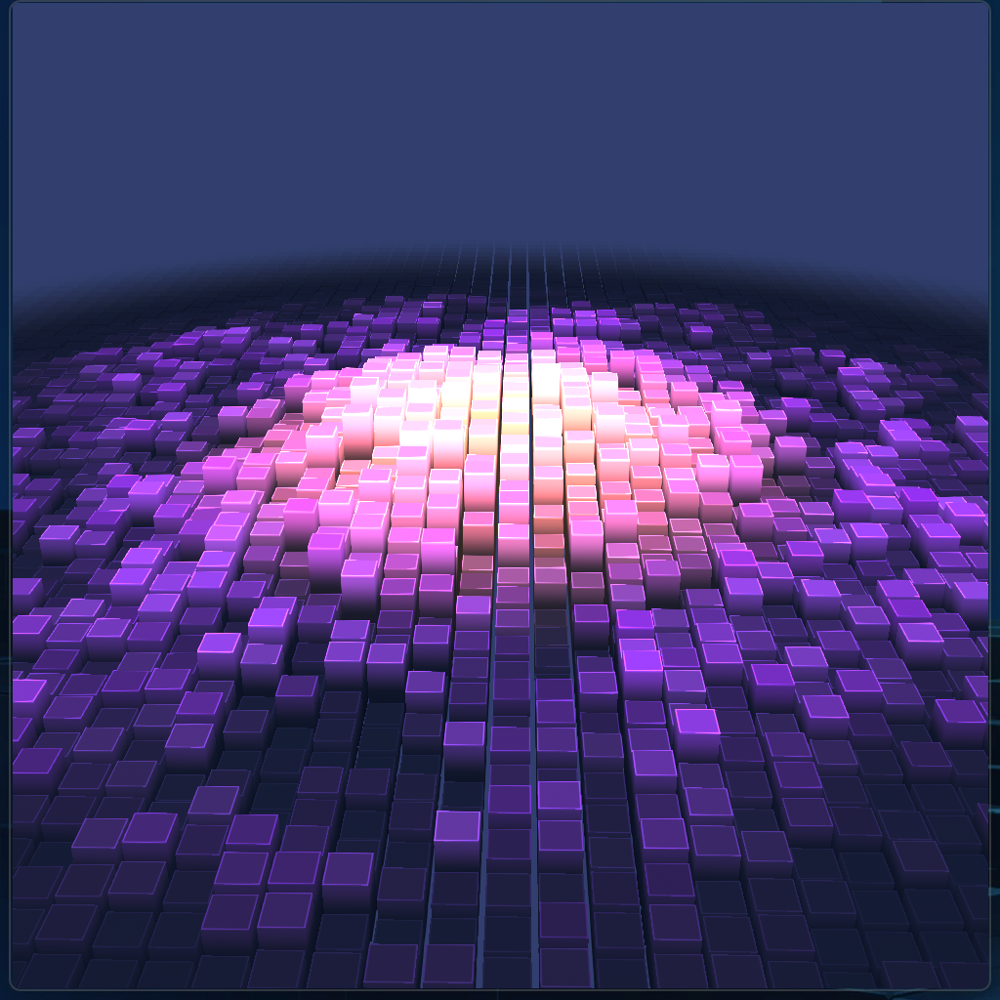
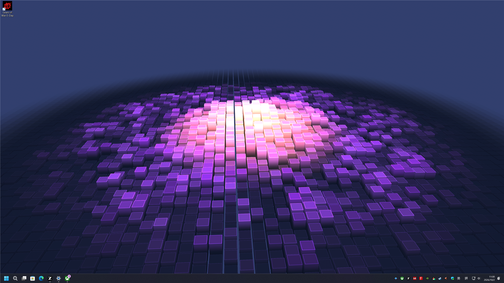
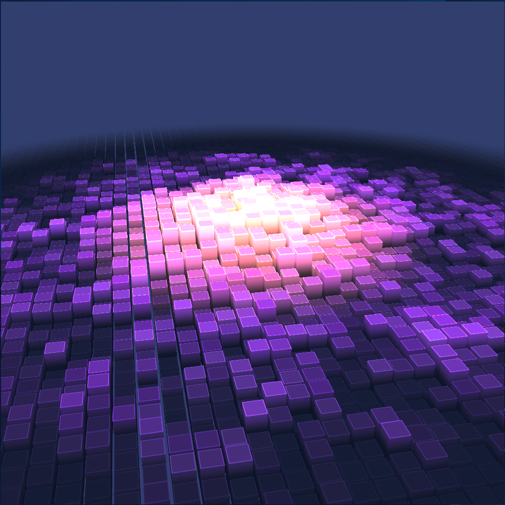

**English** | [**中文**](README.md)

<div align="center">
  

  <h1>SpectrumVisualization</h1>

  <h3>Every beat you can see</h3>

  <p>
    A lightweight audio-spectrum visualizer built with WinUI 3 / Win2D / D3D12 / ComputeSharp<br>
    WASAPI loopback · Two complementary effects · HDR10 · AA / temporal reconstruction · Wallpaper mode
  </p>

  <p>
    <a href="https://github.com/Johnwikix/SpectrumVisualization"></a>
    
    
    <a href="LICENSE.txt"></a>
    
  </p>

  

</div>

---

## Table of Contents

- [Highlighted Features](#highlighted-features)
- [Download & Install](#download--install)
- [Demonstration](#demonstration)
- [Community](#community)
- [Contribute & Build](#contribute--build)
- [License & Credits](#license--credits)

---

## Highlighted Features

### Two complementary render pipelines
- **Aurora Ring (default):** A Win2D / SDR ring for the embedded widget. The spectrum bars pick colors from the album art's primary tone plus a 4-color palette, bass hits fire a ripple ring, and the cover "breathes" with the bass envelope. The SMTC cover and title are pulled automatically.
- **Sonic Topography:** A dedicated D3D12 + ComputeSharp render thread. Writes an FP16 linear scene that ends up encoded as either SDR or HDR10; the terrain height field follows a 15-dim audio feature vector in real time, and beats / meteor bursts leave ripples and particles behind.

### Anti-aliasing and temporal reconstruction
- **Off / FXAA 3.11 / SMAA 1x HIGH** for spatial AA, with no extra DLL dependencies for the closed variant.
- **XeSS / FSR 3.1 / DLSS + DLAA** for temporal reconstruction, with explicit DLSS J / K / L / M presets. SDK headers and DLLs are pinned by SHA-256; SDK initialization failure silently falls back to FXAA while keeping the user's selection.
- **A shared output pipeline** owns SDR / HDR10 brightness mapping, PQ / sRGB encoding and dither. Toggling HDR or AA does not rewrite saved preferences.

### HDR10 output and display detection
- White point 80–500 nit, peak 80–4000 nit. The window's actual display is detected automatically; non-HDR displays fall back to SDR silently.
- User intent (the toggle) and actual output (HdrStatus) are tracked separately; the Settings page reports the current HDR10 / SDR / Unavailable / Failed state directly.

### Wallpaper mode with auto-pause
- The tray toggle expands the current effect across the primary screen below desktop icons; turning it off restores the widget's previous bounds and locked / full-screen state.
- The renderer auto-pauses when a maximized or fullscreen window on the primary screen fully covers the wallpaper, and resumes the moment it does not. Secondary-screen changes, the desktop showing, hidden / transparent windows do not trigger false pauses.

### Custom title bar and lock state
- Self-painted drag region plus minimize / maximize / close buttons that fade in on hover.
- Lock state uses `WS_EX_LAYERED` click-through; a two-stage idle / hover polling timer hands the buttons back to the cursor while hovering. Locked windows stay out of the taskbar and never steal focus.

### Tray + SMTC
- Tray context menu: toggle wallpaper mode, unlock, cycle effect, open settings, exit.
- SMTC playback is observed with HQPlayer preferred, a double empty-enumeration guard for stable Playback sessions, and a replay cache so flipping back to Aurora does not blank the title / artist.
- A debug overlay shows FPS, submission / drop counts, CPU / Present / GPU wait, input / output dimensions, AA mode, HDR and presentation path, sampled at 0.5 Hz on the UI thread.

### Localization and settings
- zh-CN / en-US resw files are kept in sync; the resource keys are checked statically before commit. The first-launch language follows `Windows.System.UserProfile.GlobalizationPreferences`.
- Three-layer settings: `AppSettings` (runtime state + `Changed` event), `SaveSetting` (persistence DTO whose property names are the JSON field names) and `SettingManager` with the source-generated `SettingsJsonContext`. Adding a setting touches at least four locations; the default must be written and kept identical in both `AppSettings` and `SaveSetting`.

### NativeAOT and trimming
- Release publishes set `PublishAot=true` / `PublishTrimmed=true` / `SelfContained=true` / `BuiltInComInteropSupport=true` / `PublishReadyToRun=true`. x64 only.
- The C++ bridge (`Native/Reconstruction/`) exposes a C ABI that only borrows the host D3D12 device, command list and textures; it does not own a swap chain, audio endpoint, UI thread or frame loop. A dedicated low-priority thread warms up spatial AA and the available SR modes at startup. HLSL bytecode and the device are handed to the live renderer when ready.

---

## Download & Install

<div align="center">

| Microsoft Store (Recommended) | Manual Install |
| :---: | :---: |
| Not yet published | **Build from source (Release NativeAOT):** see [Contribute & Build](#contribute--build) below |

**[Changelog](doc/Changelog.md) · [Design & verification](doc/design/) · [License](LICENSE.txt)**

</div>

---

## Demonstration

The main window opens at 1024×1024 and supports widget / fullscreen / maximized / locked states. Toggling "Wallpaper (primary display)" in the tray expands the current effect across the primary screen below desktop icons.

> Animated demo: [doc/pic/example.gif](doc/pic/example.gif)

### Mode screenshots

Both effects captured live in the window widget, wallpaper (primary screen) and locked modes (window centered on a 4K primary display):

| Effect | Window widget | Wallpaper (primary screen) | Locked |
| :--- | :---: | :---: | :---: |
| **Aurora Ring** |  |  |  |
| **Sonic Topography** |  |  |  |

Snapshots gathered by the offscreen / on-machine verification scripts (see [`doc/verification/`](doc/verification/)):

- [Aurora cover transition](doc/verification/aurora-cover-transition.png)
- [Aurora text transition](doc/verification/aurora-text-transition.png)
- [Settings page](doc/verification/aurora-settings.png)
- [Sonic Topography, NativeAOT offscreen](doc/verification/native-sonic.png)
- [Sonic Topography rotation A](doc/verification/sonic-rotation-a.png)
- [Sonic Topography rotation B](doc/verification/sonic-rotation-b.png)
- [Wallpaper mode (primary)](doc/verification/wallpaper-primary.png)
- [Tray menu with icons](doc/verification/wallpaper-tray.png)
- [Widget after Wallpaper is turned off (UIA overlay)](doc/verification/wallpaper-restored.png)

---

## Community

Per project convention, **on-machine display and interaction tests are performed by the user.** Unless explicitly authorized during a turn, contributors do not start or operate the main application / Settings window, do not run UI automation, do not take desktop screenshots, do not measure on-screen FPS, do not toggle wallpaper mode, do not change display HDR / resolution, and do not interfere with the user's audio environment. Verification is offscreen-driven; see [verification scope](doc/verification/) ([`doc/verification/README.md`](doc/verification/README.md) is the index).

Report issues or feedback:

- GitHub: [Johnwikix/SpectrumVisualization](https://github.com/Johnwikix/SpectrumVisualization)
- Mirror (linked from the [Settings page](View/SettingWindow.xaml)): [Gitee](https://gitee.com/people_1/win-ex-spectrum-test)

---

## Contribute & Build

### Development environment

- Windows 10 1809 (10.0.17763.0) or newer, **x64 only**
- .NET 10 SDK
- Visual Studio 2026 with the Windows App SDK and C++ workloads (building the native bridge additionally requires the VS 2026 C++ x64 toolset v145 and the Windows SDK)
- PowerShell 7

### Debug build

```powershell
dotnet build WinExSpectrumTest.csproj -c Debug -p:Platform=x64 -p:WindowsPackageType=None
```

### Release NativeAOT publish

```powershell
dotnet publish WinExSpectrumTest.csproj -c Release -r win-x64 -p:Platform=x64 `
    -p:PublishAot=true -p:PublishTrimmed=true -p:BuiltInComInteropSupport=true `
    -p:WindowsPackageType=None -p:AppxPackage=false `
    -p:GenerateAppxPackageOnBuild=false -p:EnableMsixTooling=false `
    -p:AppxPackageSigningEnabled=false
```

Output: `bin/x64/Release/net10.0-windows10.0.26100.0/win-x64/publish/Spectrum.exe`. `ReconstructionAssets.targets` builds the native bridge and copies the XeSS / FSR / DLSS release DLLs and licenses into the publish directory.

- Reuse an already built bridge: `-p:SkipReconstructionNativeBuild=true`
- Spatial-AA-only variant: `-p:EnableVendorReconstruction=false` (start from a clean output directory)

### Verify vendor SDKs

```powershell
./External/Upscalers/Restore.ps1 -VerifyOnly
./Native/Reconstruction/Build.ps1
```

`Restore.ps1` verifies SHA-256 and refills missing files from their pinned upstream commits.

### Repository conventions (see `AGENTS.md`)

- Touches to the render thread, audio pipeline, settings system or localization require re-running the corresponding offscreen probe or a Release NativeAOT publish.
- Every functional change adds a top entry in [`doc/Changelog.md`](doc/Changelog.md).
- The default code-quality and review standards are listed in the closing section of [`AGENTS.md`](AGENTS.md).

### Offscreen probes (separate projects, excluded from the main build)

```
doc/verification/
├─ AudioProbe.csproj            # NativeAOT WASAPI sample-rate fallback and capture cadence
├─ AuroraProbe/                 # Aurora stereo mirror / seam-difference regression
├─ AuroraRenderProbe/           # Aurora cover / text transition real-draw regression
├─ HdrProbe/                    # HDR / SR / FXAA / SMAA / temporal reconstruction offscreen regression
├─ WallpaperOcclusionProbe/     # Fullscreen / maximized occlusion regression
└─ desktop.ps1, ui-test.ps1,
   wallpaper-*.ps1              # Desktop / state / wallpaper / tray regression scripts
```

See [`doc/verification/README.md`](doc/verification/README.md) and [`doc/design/gpu-effects-quality-aa.md`](doc/design/gpu-effects-quality-aa.md) for details.

---

## License & Credits

This project is open-source under the **[MIT License](LICENSE.txt)**.

### References & Inspiration

| Project | Use |
| --- | --- |
| [BetterLyrics](https://github.com/jayfunc/BetterLyrics) | Early inspiration for SMTC text and cover reading |
| music_player | Custom title bar, layered click-through lock, adaptive desktop-lyrics text color, `AnimatedTextBlock` text animations, desktop wallpaper host |
| [ComputeSharp](https://github.com/Sergio0694/ComputeSharp) | D3D12 compute shader integration |
| [Intel XeSS](https://github.com/intel/xess) | Temporal reconstruction (J / K / L / M presets) |
| [AMD FidelityFX SDK](https://github.com/GPUOpen-LibrariesAndSDKs/FidelityFX-SDK) | FSR 3.1 |
| [NVIDIA NGX DLSS](https://github.com/NVIDIA/DLSS) | DLSS / DLAA |
| [SMAA 1x](https://github.com/iryoku/smaa) | Spatial anti-aliasing |
| [FXAA 3.11](https://download.nvidia.com/developer/tools/SDK/10.5/FXAA_WhitePaper.pdf) | Brightness-mapped edge cleanup |

Vendored SDKs under `External/` and the third-party shaders retain their original terms. The `Licenses/` directory collects the license texts that ship with the published output. `External/Upscalers/README.md` lists the pinned upstream commits and SHA-256 for XeSS / FSR / DLSS; distributors must satisfy each SDK's trademark / attribution / end-user license / commercial-release requirements. Keeping the files in this tree does not itself complete those requirements.

---

<div align="center">

<sub>This project is open-source under the MIT License. All third-party resources belong to their respective owners.</sub>
<br>
<sub>On-machine display / interaction tests are performed by the user; builds and offscreen verification live under `doc/verification/`.</sub>

</div>