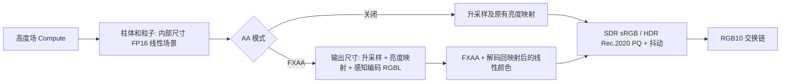

# GPU 效果宿主、音域回响性能与抗锯齿设计

日期：2026-09-28。状态：已按用户授权实现公共 GPU 宿主、地形光栅化、画质档位与 FXAA；用户要求停止后续验证，实屏 1440p / 120 FPS 由用户验收。

实现对应关系：`SonicSceneRenderer` 最终命名为 `SonicGpuEffect`；公共类型位于 `Rendering/Gpu*`，档位定义位于 `Model/SonicQualitySettings.cs`。下文“已核对事实”记录的是改动前基线，不代表现行代码。已取得的验证证据、保留边界和接入说明见 [实现记录](../verification/gpu-quality-aa.md)。

## 1. 目标与范围

本次直接依据用户需求形成设计草案，不建立 PRD、工单或新的开发流程。交付目标为：

- 抽取可供更多 ComputeSharp / D3D12 效果使用的 GPU 宿主与 HDR 输出能力。
- 优化音域回响，增加画质档位与独立抗锯齿设置。
- 最低画质以本机 Intel Arc 140T 在 **2560×1440 物理像素输出、120 FPS** 为验收目标。

1440p 在本设计中指交换链输出尺寸。最低档允许使用低于 1440p 的内部场景分辨率，这是提交评审的画质取舍；不把它称为原生 1440p 渲染。120 FPS 是硬件验收目标，尚不是实测结果。

本次包括：GPU 宿主抽取、音域回响地形渲染优化、静态画质档位、FXAA、120 Hz 帧调度、设置和本地化、验证探针。极光之环保留 Win2D。动态分辨率、TAA、运动矢量、超分辨率 SDK、通用渲染图、运行时 shader 插件及所有效果统一迁移不在本期范围内。

## 2. 已核对事实

| 项目 | 当前证据 |
| --- | --- |
| 本机设备 | 2026-09-28 通过 Win32_VideoController 读取到 Intel(R) Arc(TM) 140T GPU (15GB)，驱动 32.0.101.8826；名称中的 15GB 不作为独立显存容量依据 |
| 当前桌面 | 2880×1800、120 Hz；全屏像素数比 2560×1440 多 40.625%，两者必须分开报告 |
| 设备选择 | SonicGraphics 使用 GraphicsDevice.GetDefault；性能探针还须记录实际 D3D12 adapter 名称和 LUID，不能仅凭系统显卡列表判定渲染设备 |
| 地形计算 | SonicTopographyEffect.Render 先执行 HeightFieldShader，再执行全屏 TerrainShader；后者每像素执行 DDA，循环上限为 gridSize×2+1 |
| 当前中间图 | 全输出尺寸 FP32 地形纹理，复制至 FP16 场景，再合成粒子并编码到 RGB10 |
| 重复计算 | HeightFieldShader 在每个网格重复计算相同的频段提升曲线、涟漪随时间衰减等；额外的四次闲置噪声在 idleWave 为零时仍执行 |
| 设置现状 | 网格运行时默认 160；UI 提供 120、160。刷新率默认 60，上限 120。没有画质档位、内部渲染比例、AA 设置 |
| 扩展限制 | SonicGraphics 构造具体效果；CanvasPanel 把非 sonic-topography 的 ID 归为 aurora-ring；EffectRegistry 只有名称目录 |
| 帧调度 | SonicRenderer 按当前帧耗时计算余量，并用向上取整的整毫秒 WaitOne 等待；Present(DoNotWait) 返回 WasStillDrawing 仍会走到帧计数 |
| 现有验证 | HdrProbe 覆盖颜色回读、生命周期和预热分配；现有 hdr.md 的历史设备为 RTX 5070 Ti，不能用于证明本次 Arc 140T 性能 |

代码依据：`Rendering/SonicGraphics.cs:51,176,184`、`Rendering/SonicRenderer.cs:149`、`Effects/Sonic/SonicTopographyEffect.cs:305`、`Effects/Sonic/Shaders/TerrainShader.cs`、`Effects/Sonic/Shaders/HeightFieldShader.cs`、`Canvas/CanvasPanel.xaml.cs:59`、`Effects/IVisualizerEffect.cs:49`。

以上是调用链事实。哪一阶段在 Arc 140T 上占主导、可获得多少性能收益，仍需 GPU 采样，不由代码形状直接推定。

## 3. 约束与假设

### 必须满足的约束

- 遵守 AGENTS.md：稳态帧循环不引入托管分配；UI 不等待 GPU 或同步 Join；效果停用及退出必须处理在途工作。
- 保留 `sonic-topography`、`aurora-ring` 的持久化 ID、所有既有 JSON 字段及其含义。
- AppSettings 为运行时设置来源，SaveSetting 为持久化 DTO；新设置同步两个映射方向、源生成 JSON、ViewModel、XAML、中英文 resw。
- 新效果消费原 SpectrumAnalyzer；不新增音频捕获，不每帧复制整组频谱。
- 线性场景为 Rec.709，参考白为 1，允许高光超过 1；HDR 白点、峰值与 PQ 只由公共输出阶段处理。
- XAML 媒体卡片保持 Windows 合成的 SDR 图层，不进入低分辨率场景或 FXAA。
- 修改原生资源、同步或封送后，必须进行 Release NativeAOT 发布和真实集成验证。

### 待验证假设

| 假设 | 若被证伪如何处理 |
| --- | --- |
| 实例化柱体更适合本机 120 FPS 预算 | 对同等分辨率、网格和输入比较 GPU 时间；若无稳定收益，重新分析高度场、像素着色或同步，不仅凭迁移完成就替换旧路径 |
| 50% 内部分辨率、80×80 网格可作为最低档起点 | 实测有余量则上调画质；达不到目标则继续优化，不能用降低验收帧率、关闭 HDR 或改变目标设备来宣布完成 |
| FXAA 适合作为本期低成本 AA | 以 HDR 高光、红蓝紫色边缘、运动细线测量；不合格则调整输入亮度和阈值，必要时重新评审算法，不用整体模糊代替抗锯齿 |
| 有条件固定插电与电源模式测试 | 记录实际供电、Windows 电源模式、驱动和温度状态；未测电池状态时不承诺电池状态下同等性能 |

## 4. 公共宿主边界

### 4.1 模块职责

| 模块（拟定名称） | 责任和所有权 |
| --- | --- |
| EffectRegistry / EffectDescriptor | 稳定 ID、资源键、Win2D/GPU 宿主类型、静态创建工厂、是否使用媒体覆盖层；目录读取不构造设备 |
| GpuPanel | 从 SonicPanel 抽取。UI 线程维护 SwapChainPanel、物理输出尺寸与逆 DPI 缩放、绑定确认、状态通知 |
| GpuRenderer | 从 SonicRenderer 抽取。独立工作线程、最新请求与设置快照、暂停/停止、帧调度、设备恢复 |
| GpuGraphics | 从 SonicGraphics 抽取。拥有共享设备、队列、命令分配器、fence、交换链、线性场景及公共输出资源 |
| ColorOutputPipelines | 公共 SDR/HDR 亮度映射、色域转换、FXAA 前置准备、FXAA 输出、编码和最终抖动 |
| IGpuVisualizerEffect | 在工作线程初始化、调整尺寸、准备一帧、记录场景绘制及释放 |
| SonicTopographyEffect / SonicSceneRenderer | 音域回响的模拟、主题、相机、高度场、柱体/粒子 PSO、深度纹理和上传缓冲；具体粒子容量不进入公共宿主 |

只抽取已有且确实共享的职责，不为未来效果建立通用材质系统、资源调度图或跨后端接口。IVisualizerEffect 仍专用于 Win2D。

### 4.2 效果协议

接口约定为 `Initialize`、`Resize`、`PrepareFrame`、`RecordScene`、`Dispose`，具体签名在实现时依照现有类型收敛：

- Initialize 借用同一 GraphicsDevice / ID3D12Device、分析器和必要的分配服务；效果不能释放宿主设备。
- Resize 接收输出物理尺寸、内部场景尺寸；效果预分配自己的 GPU 资源。窗口为零或不可见时不创建零尺寸纹理。
- PrepareFrame 消费一次设置快照及音频数据，推进模拟、上传小缓冲并完成 ComputeSharp 前置计算。此阶段返回后，其输出可以交给 Direct 队列读取。
- RecordScene 借用本帧命令列表及 FP16 场景 RTV；效果记录自己的屏障、PSO、descriptor heap、绘制命令。每次明确设置自身状态，不能依赖上一个效果残留状态。
- 宿主提交 Direct 命令并呈现；效果不能 Present、提交宿主命令列表或决定输出色彩空间。
- 普通计算效果可生成线性纹理后使用一个小型全屏复制辅助函数写入场景；音域回响直接光栅化到场景，不承担这次复制。
- 宿主处理场景颜色目标的转换；效果处理其高度场等私有资源的转换。私有 ComputeSharp 资源在下一次 dispatch 前恢复其要求的状态。
- 两类效果都输出已合成背景的不透明场景；透明窗口效果不在当前协议内。

注册和创建使用明确的静态工厂，不使用反射发现。用验证目录中的第二个最小 GPU 效果验证扩展：增加效果和注册信息后，公共宿主不再增加按效果 ID 判断的分支。测试效果不出现在产品目录中。

### 4.3 生命周期与失败处理

- GPU 效果之间切换复用设备和交换链；帧边界等待相关 GPU 工作结束后替换效果，最多保留一个活动效果和一个创建中的候选效果。
- Win2D/GPU 切换保留现有双宿主屏障。暂停确认表示旧帧与相关 GPU 使用已退出，不能只改变 Active 标记。
- 效果请求与设置更新使用最新版本号；快速连续切换最终落到最后一次显式请求。停止请求优先级最高。
- 设置变更在 UI 线程先形成完整参数组，再发布不可变值快照；工作线程只在帧边界应用，禁止看到低档分辨率配高档网格等半更新状态。
- 候选效果或重建资源失败时释放部分创建资源、保留可用旧资源并发布实际失败状态；不静默修改用户保存的档位或效果 ID。设备失效则由工作线程统一释放和重建。
- 连续配置合并为最后一个版本，一次重建；旧资源在 GPU fence 完成之后释放。AA 关闭后释放 AA 专有纹理，停止其绘制阶段。
- 退出唤醒所有等待，工作线程完成解绑和释放后确认停止；UI 用 await 等待，不能阻塞 DispatcherQueue 的绑定确认。
- HDR 支持从宿主能力判断；将现有 HdrOutputMode.Aurora 的具体效果语义改为通用不支持状态，显示文本使用独立资源键。

## 5. 音域回响 GPU 优化

### 5.1 主方案：高度场计算 + 实例化柱体

保留 HeightFieldShader 的音频形状和动态状态，将 TerrainShader 的全屏 DDA 改为固定柱体网格的实例化绘制：

1. 每帧在 GPU 生成 N×N 高度场，仍保存高度、普通涟漪、流星涟漪、峰值参数。
2. 一份静态柱体网格，通过 SV_InstanceID 定位网格坐标；顶点着色器用整数 texel Load 读取该格高度，避免插值改变柱体形状。
3. 使用硬件裁剪、背面剔除和深度测试确定可见表面；通常一次实例化调用绘制全部柱体。
4. 将原 Shade 的主题、顶面边缘、闪光、峰值和雾移到像素着色器，使用世界坐标、面法线、单元中心保持语义一致。
5. 粒子继续使用现有 CPU 模拟和预分配上传缓冲，在同一线性场景中合成。

这一方案针对的是“每个屏幕像素遍历许多柱体单元”的计算量；不声称仅仅减少 draw call，因为当前地形本就只有一个全屏 dispatch。D3D12 的实例化支持由顶点着色器按 SV_InstanceID 取得实例数据，参见 [DrawInstanced 文档](https://learn.microsoft.com/en-us/windows/win32/api/d3d12/nf-d3d12-id3d12graphicscommandlist-drawinstanced)。

保持画面的关键约束：

- 透视、相机旋转方向、柱体间距和音频响应不变；低档的网格数及分辨率取舍必须明确。
- 原远处 alphaFade 是命中表面与天空混合，不是透视后方柱体；新地形仍写不透明颜色并写深度，显式混合背景，不能改为普通透明物体排序。
- 粒子当前作为投影覆盖层绘制；本次不顺便增加粒子与地形的深度遮挡。
- 旧配色里线性/显示颜色混合的兼容转换要集中保留，不能在重写着色器时整体提亮或改变主题。
- 近远裁剪面要覆盖允许的网格和动态高度。旧 DDA 固定 MaxTerrainHeight=30 不能直接作为新场景的全局高度保证，需用强响应场景验证。
- 旧 DDA 留在验证探针作固定相机、固定音频、固定随机种子的对照。对照通过之后正式路径只保留一个地形后端，不让每个画质档位对应另一套渲染算法。

先在相同 100% 分辨率、160 网格、AA 关闭下比较旧/新路径，再测低档；这样能区分算法收益与主动降低画质的收益。

### 5.2 减少重复计算和全屏流量

- 将频段 EaseLift/FlowLift、每条涟漪的时间半径和衰减等与网格位置无关的量每帧计算一次，通过已有小上传缓冲传入；不移动空间相关的噪声和波形。
- idleWave 完全为零时，通过帧内一致的分支跳过它专用的四次噪声；保留原本始终存在的背景起伏。
- 避免每帧重新计算不变的相机常量、网格常量；不为此建立大型通用缓存或改变分析器。
- 新光栅路径删除全输出分辨率的 FP32 地形颜色纹理及其复制阶段。高度场仍为小尺寸 FP32；场景为内部尺寸 FP16，深度为内部尺寸 D32。
- shader 及 PSO 在初始化或确有必要的配置边界创建；纹理、上传缓冲、顶点缓冲和描述符逐帧复用。
- 不承诺直接将 ComputeSharp 的 float4 颜色纹理改为 FP16；主方案通过移除这张全屏纹理解决其开销，不依赖未验证的半精度 typed UAV 支持。

以 1440p 输出、最低档内部 1280×720、AA 关闭为例，主要尺寸相关纹理的理论容量约为：两个 RGB10 back buffer 28.125 MiB、FP16 场景 7.031 MiB、D32 深度 3.516 MiB，共 38.672 MiB。旧路径对应 back buffer、FP32 地形、FP16 场景合计约 112.5 MiB。此计算不包括驱动对齐、桌面合成、框架缓存和其他资源，不能当作真实 GPU 内存测量。

### 5.3 同步与 120 Hz 调度

- 第一版维持可证明的串行资源所有权：ComputeSharp 前置计算完成，Direct 队列读取高度场并完成一帧，下一帧才复用资源。抽取期间不同时引入跨帧多缓冲。
- 对这两次同步的 CPU 等待和 GPU 空闲单独计时；若它们使 8.33 ms 预算无法满足，再评审双缓冲或 GPU 队列 fence 方案，不直接删 WaitForGpu。
- 帧调度改为基于单调时钟累计的绝对下一帧截止时刻，避免向上取整的相对毫秒等待逐帧拖慢 120 Hz。迟到时丢弃过期调度点，不突发补画。
- 使用可被配置/暂停/停止事件打断的高精度可等待计时器；预分配句柄，不忙轮询，不修改全系统计时器精度。Windows 支持说明见 [CreateWaitableTimerExW](https://learn.microsoft.com/en-us/windows/win32/api/synchapi/nf-synchapi-createwaitabletimerexw)。
- Present 的成功、WasStillDrawing、设备错误分别计数；成功提交次数也不等于用户实际看到的帧数，最终以显示帧统计验收。

## 6. 画质档位与设置

以下为待 Arc 140T 实测校准的初始档位，并非已经证明达标的值：

| 画质 | 内部渲染比例 | 1440p 输出时内部尺寸 | 网格 | 抗锯齿 |
| --- | --- | --- | --- | --- |
| 性能（最低） | 50% | 1280×720 | 80×80 | 关闭 |
| 均衡 | 75% | 1920×1080 | 120×120 | FXAA |
| 高 | 100% | 2560×1440 | 160×160 | FXAA |
| 自定义 | 当前参数 | 按当前比例计算 | 当前参数 | 当前参数 |

最低档保留涟漪、流星、相机运动和 HDR，只降低空间采样密度及 AA 成本。若 50%/80 有充分性能余量，优先上调画质，最终在设计和变更记录中同步已验证参数。

界面新增“画质”下拉框和“抗锯齿”下拉框；高级项提供内部渲染比例和现有网格密度。手动修改后档位按实际组合显示为自定义。档位不会修改现有 HDR 开关、白点、峰值、音频强度、特效开关或刷新率。验收时将已有刷新率设置为 120。

### 数据模型

- 新增 `SonicRenderScalePercent`，默认 100；允许 50～100 的整数百分比，UI 使用固定候选值，越界值恢复默认。
- 新增 `SonicAntiAliasing`，稳定字符串值 `off`、`fxaa`，默认 `off`；未知值恢复默认。运行时可以使用枚举，但持久化不依赖反射枚举转换器。
- 继续使用 `SonicGridSize`；UI 补入 80，保留现有字段和有效存量值。加载到非预设网格显示自定义。
- 画质档位由上述实际参数匹配得到，不另存一份可能与参数冲突的 `Quality` 状态。选择档位是一次原子参数组更新；一次发布、一次重建和一次保存，不依次触发三次资源重建。
- 旧配置缺少新字段时仍为 100% 和 AA 关闭，默认网格仍为 160；因此显示为自定义，但不会默默降低老用户画质。
- 每个参数沿 AppSettings、SaveSetting、LoadSettingAsync、CreateSaveSetting、SettingViewModel、XAML、两份 resw 同步。只借助窄范围的画质参数组更新，不重构整个设置系统。

内部尺寸从物理输出尺寸计算，宽高至少 1，并按 dispatch 的真实边界进行保护；光栅 viewport/scissor 使用内部尺寸。粒子投影随内部尺寸缩放，相机使用输出的正确宽高比。SwapChainPanel 的 DIP/物理像素换算和 XAML 布局只取输出尺寸，不受画质比例影响。

## 7. 抗锯齿与 HDR

本期提供“关闭 / FXAA”两种模式；使用已有 FXAA 3.11 算法与固定低成本质量预设，保留来源和许可。暂不提供 MSAA、SMAA、TAA，以限制新增缓冲、管线和调参面。

FXAA 不直接处理无限范围的线性 HDR，也不直接拿最终 PQ 码值做平均。NVIDIA 的 [FXAA 说明](https://developer.download.nvidia.com/assets/gamedev/files/sdk/11/FXAA_WhitePaper.pdf) 指出，亮度映射前的高动态范围输入可能使亮暗交界的抗锯齿失效；[FXAA 3.11 参考实现](https://github.com/GameTechDev/CMAA2/blob/master/Projects/CMAA2/FXAA/Fxaa3_11.h) 给出了亮度映射后 RGBL 输入及感知亮度要求。

### 确定的输入输出约定

1. 先在线性空间完成地形、背景和粒子合成、按需要升采样至输出尺寸。
2. HDR 复用现有白点和高光压缩得到显示亮度，再按当前 peakNits 归一化；SDR 复用现有 [0,1] 截断。此处不是将 HDR 高光截断到 SDR 白点。
3. 将有界 RGB 做 gamma 2.0 感知编码，alpha 保存感知亮度，写入输出尺寸的 FP16 RGBL 中间图。拒绝用绿色通道代替亮度，避免红、蓝、紫主题漏检边缘。
4. FXAA 在输出像素网格执行，既处理地形又处理粒子。取样后逆 gamma，HDR 恢复 peakNits 尺度，再执行 Rec.709→Rec.2020 和 PQ；SDR 执行 sRGB 编码。
5. RGB10 量化抖动只在最后执行，避免噪声干扰边缘检测。AA 关闭路径保留原来的单次映射/编码，不额外往返转换。

HDR 适配仍须通过颜色回读和视觉对照；不能因为采用已有 FXAA 就认定自定义的 HDR 适配已经正确。FXAA 为空间算法，不能保证消除所有细线的时间闪烁，也不能恢复降低内部分辨率时丢失的细节。

AA 开启会增加一张输出尺寸 FP16 中间图和一个准备 pass，FXAA 与最终编码合并。1440p 下该中间图理论容量为 28.125 MiB。最低档默认关闭，性能目标不包含用户手动开启 AA 后的额外成本；同时单独公布低档开启 FXAA 的耗时结果。

## 8. 验收与证据

### 8.1 Arc 140T 性能验收

固定条件：实际 D3D12 adapter 为 Arc 140T，交换链为 2560×1440 物理像素，刷新率设置 120，120 Hz 显示器，插电并记录电源模式。设备驱动、HDR 系统状态和实际输出模式全部写入报告。当前 2880×1800 全屏另做扩展测量，不代替 1440p 验收。

最低档在 SDR 和实际可用的 HDR10 下分别运行；如果本机显示器不能开启真实 HDR10，明确列为缺口，不用离屏 HDR 编码回读冒充显示路径验收。

建议验收口径：每个场景预热至少 10 秒，连续记录至少 120 秒，重复 3 次。

| 指标 | 判定口径 |
| --- | --- |
| 120 FPS | 实际显示的新帧平均 ≥118.8 FPS，容许约 1% 调度/刷新误差；不是 Render 调用次数 |
| 稳定性 | 显示帧间隔 P99 ≤10 ms，丢帧/拒绝呈现单独报告，不能用重复显示同一帧填满计数 |
| GPU 预算 | 最低档各 GPU 阶段合计 P95 目标 ≤6.5 ms，给 CPU、调度及桌面合成留余量；最终以显示帧表现为准 |
| 持续性 | 用强音频输入、持续旋转、密集涟漪、流星/粒子、不同主题测试；静音/空场景不能作为唯一证据 |
| 托管分配 | 单独测预热后的生产工作线程稳态分配；尺寸/档位切换的冷路径分配另列，不把整个应用称为零分配 |

测量拆分为：高度场、柱体、粒子、AA 准备、FXAA/输出，以及 CPU 准备、同步等待、帧等待、成功/失败 Present 和实际显示间隔。GPU 时间使用 PIX 或 GPU timestamp；ComputeSharp 阶段优先用 PIX，不为了采样修改库的私有实现。D3D12 timestamp 必须按各队列频率换算，不能直接减不同队列的原始时间戳，见 [D3D12 Timing](https://learn.microsoft.com/en-us/windows/win32/direct3d12/timing)。

显示帧用 PresentMon/ETW 等能反映显示事件的工具采集，确认工具在本机合成模式下可取得所需事件。屏幕录像或应用自己的 FPS 文本仅作辅助。性能采样和分配采样分开，日志汇总不放入被测帧内热路径。

### 8.2 必要回归

- 等画质对照：旧 DDA / 新光栅路径在固定输入下比较地形位置、主题、峰值、雾、远处背景混合、粒子覆盖关系。截图差异集中检查轮廓、遮挡和高光，不要求不同光栅规则逐像素完全相同。
- AA：斜线、柱体边缘、黑底高光、红蓝紫纯色、闪光、移动相机；GPU 回读检查黑、白点、峰值和常色块，关闭 AA 时沿用既有 RGB10 码值容差。
- HDR：开关和亮度变化、多显示器切换、DPI、尺寸变化；有设备条件的实测与未执行项分开。
- 生命周期：Win2D/GPU 往返、两个 GPU 测试效果往返、连点切换、档位连切、最小化恢复、启动中退出、设备错误、候选资源创建失败。
- 设置：旧 JSON、非法新值、预设/自定义往返、重启、保存失败；组合更新期间只消费完整设置快照。
- 布局：100%/150%/200% DPI，1440p 输出及 2880×1800 全屏，场景、粒子和 XAML 卡片坐标一致。
- 壁纸：副屏、焦点、置顶、暂停恢复，保持现有回归要求。
- Release NativeAOT：新接口工厂、shader、COM/原生计时器和设置源生成均用真实发布产物执行。

优先复用 `doc/verification/HdrProbe` 的颜色与生命周期检查；必要的性能及第二效果探针放在 verification 下。纯函数测试覆盖预设匹配、尺寸计算、参数校验、调度期限；真实 GPU/UI 时序由集成检查覆盖。

## 9. 实施顺序与停止标准

1. 留存当前版本的 Arc 140T 基线、固定输入截图和输出回读结果。
2. 完成公共宿主与注册抽取，仍接旧 DDA；用第二个探针效果和切换回归证明抽取成立。
3. 完成实例化柱体及重复计算优化，在同等画质下验证正确性和性能；通过后替换正式地形路径。
4. 接入画质参数组、内部尺寸和 120 Hz 调度，测定最低档是否满足 1440p/120 目标。
5. 接入 FXAA/HDR 适配，校准均衡/高档及低档手动开启 AA 的成本，完成 UI/持久化。
6. 跑 NativeAOT、真实 UI、壁纸及性能验收；实现阶段在 `doc/Changelog.md` 顶部追加统一记录。

完成标准同时包括：新效果无需修改宿主逻辑即可接入；旧配置和非活动宿主行为保持兼容；最低档在指定硬件与明示测试条件下达到目标；AA/HDR 回归通过。只通过 build、GPU 提交频率达到 120、或仅降低分辨率后静音场景达到目标，都不能宣布完成。

若最终无法在本机达标，报告各阶段实测瓶颈与目标差距，继续评审必要的算法或同步优化；不得悄悄把目标改为 1080p、60 FPS、另一张 GPU 或关闭用户要求保留的功能。
